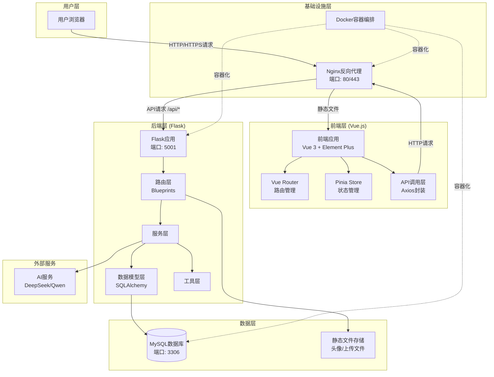
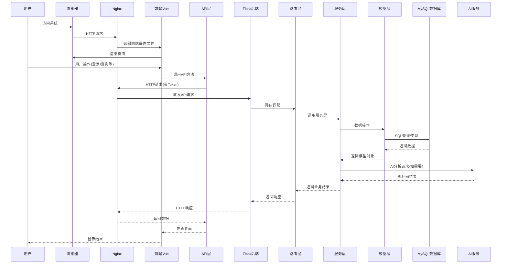
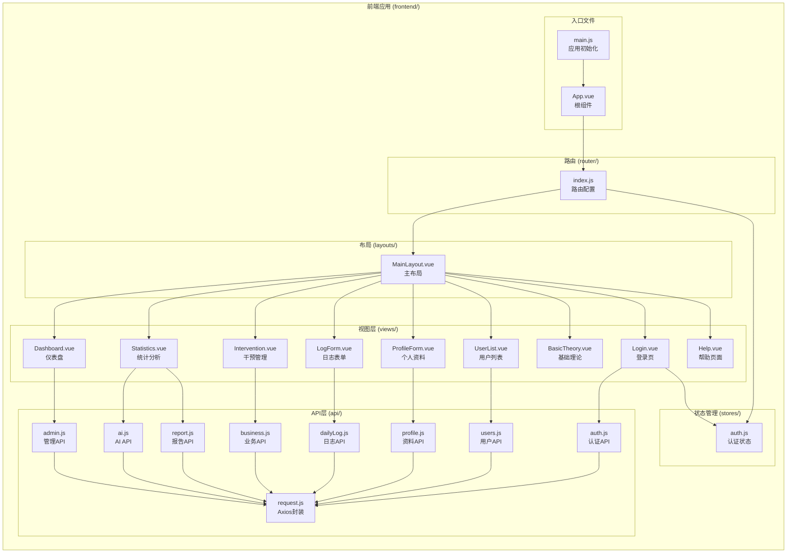
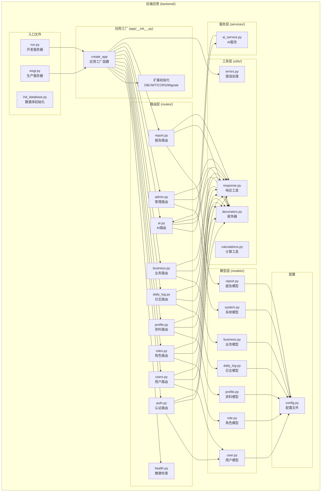
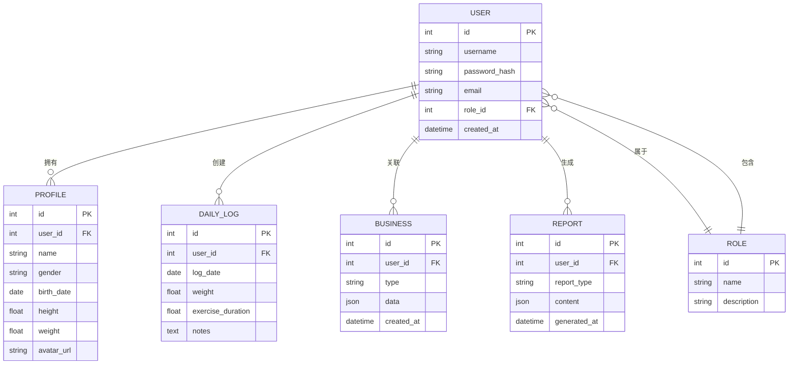
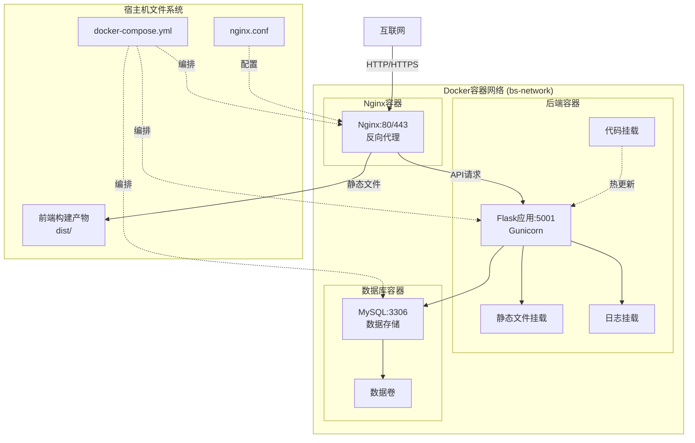
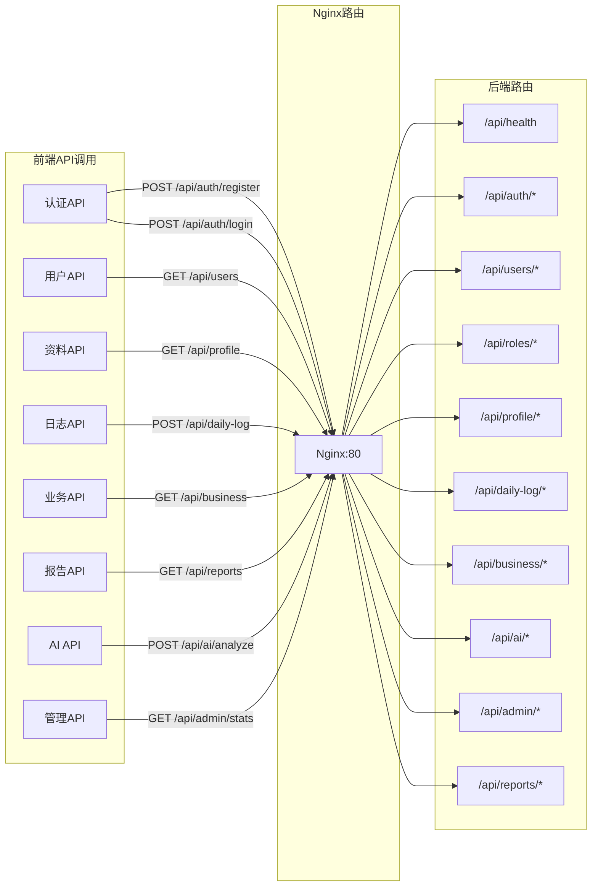
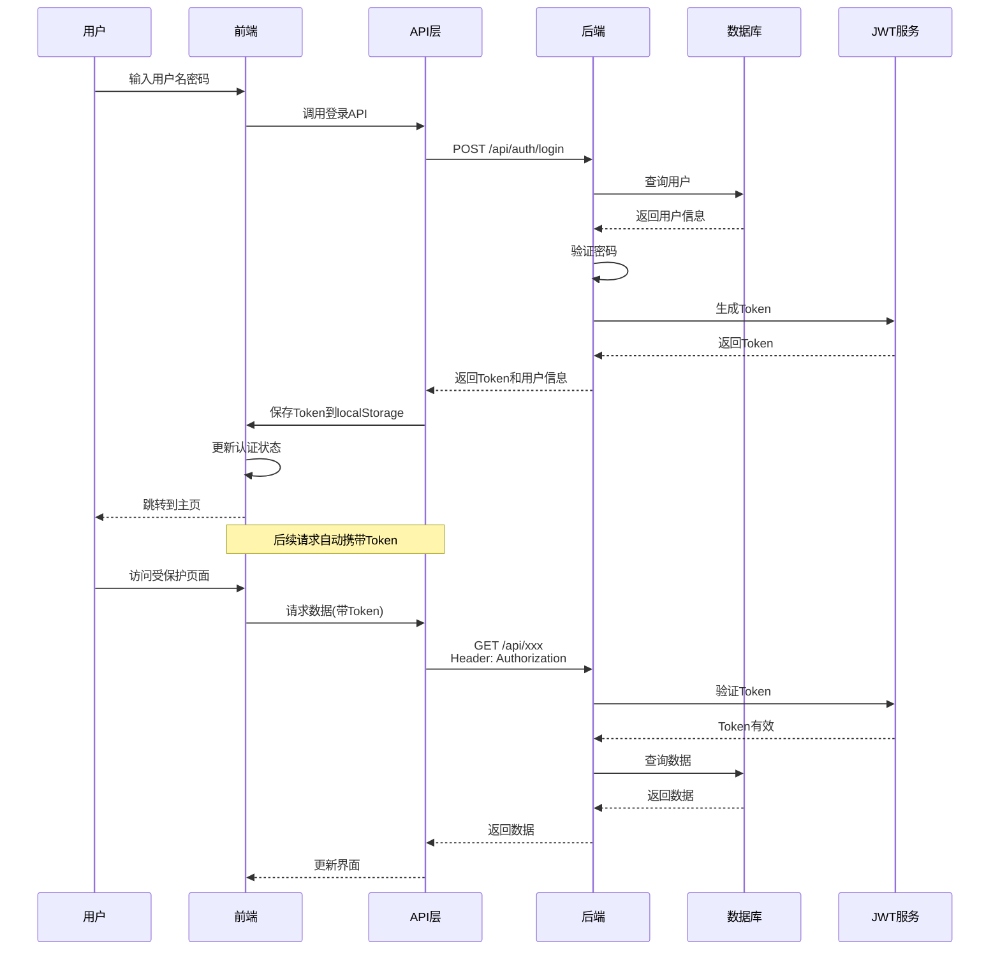

# 学生健康管理系统 - 项目结构图

## 系统架构总览

## 详细数据流向图

## 前端详细结构

## 后端详细结构

## 数据库模型关系图

## 部署架构图

## API端点映射图

## 认证流程

## 技术栈说明

### 前端技术栈
- **框架**: Vue 3 (Composition API)
- **UI库**: Element Plus
- **路由**: Vue Router
- **状态管理**: Pinia
- **HTTP客户端**: Axios
- **构建工具**: Vue CLI

### 后端技术栈
- **框架**: Flask
- **ORM**: SQLAlchemy
- **数据库迁移**: Flask-Migrate
- **认证**: Flask-JWT-Extended
- **跨域**: Flask-CORS
- **WSGI服务器**: Gunicorn

### 基础设施
- **反向代理**: Nginx
- **容器化**: Docker & Docker Compose
- **数据库**: MySQL 8.0
- **AI服务**: DeepSeek / Qwen API
